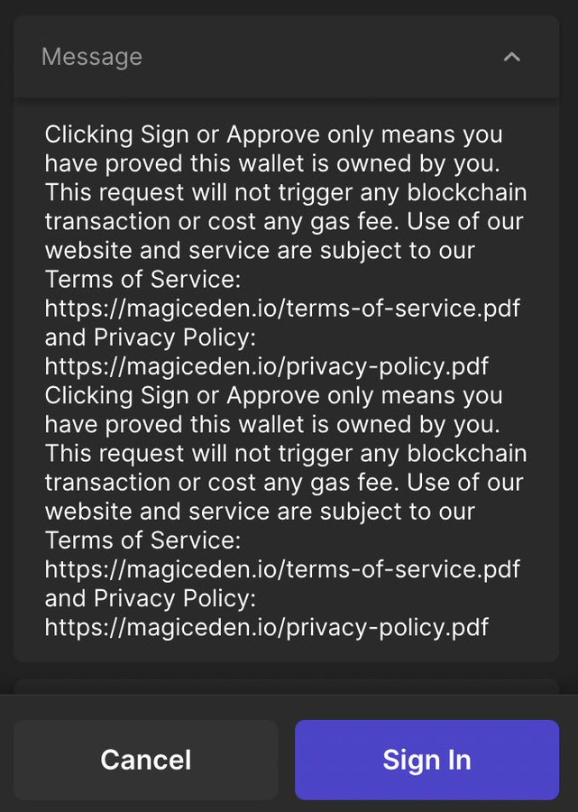
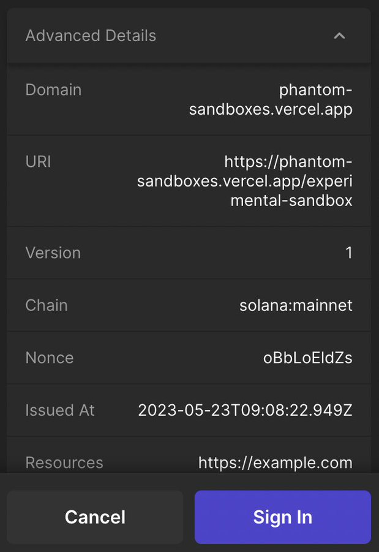
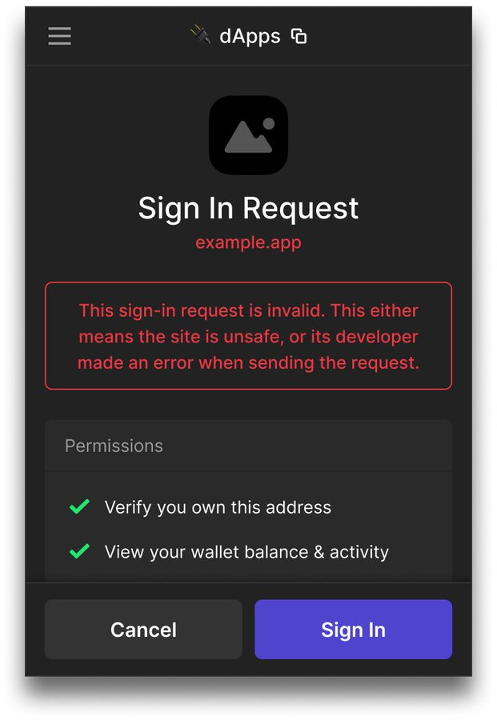
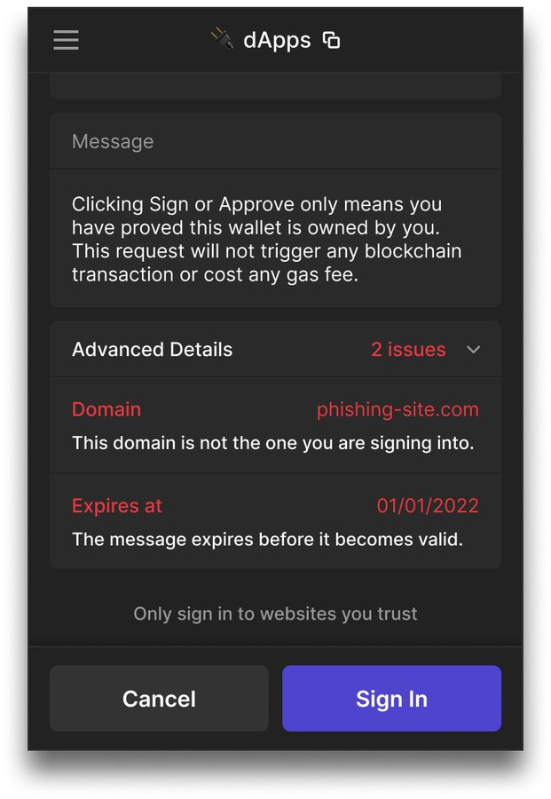

# Sign-In With Solana

## Introduction

Sign In With Solana (SIWS) is a new feature that lets dapps authenticate their users and prove ownership of their addresses. The feature aims to replace the traditionally clunky `connect` + `signMessage` flow with a one-click `signIn` method.

Phantom is pioneering support for SIWS alongside the Solana Wallet Standard. The [technical specification](https://github.com/solana-labs/wallet-standard/blob/alpha/packages/core/features/src/signIn.ts) for SIWS is modeled after [EIP-4361](https://eips.ethereum.org/EIPS/eip-4361) (Sign In With Ethereum) but extends beyond it’s capabilities. SIWS shifts the responsibility of message construction from dapps to the wallet, resulting in consistent, user-friendly interfaces and enhanced end-user security.

<p float="middle">
  
  
</p>

With SIWS, wallets can scrutinize message data to ensure its legitimacy or raise red flags for suspicious activity. Domain binding is a key feature of SIWS, enabling wallets to alert users if a website is impersonating another entity

<p float="middle">
  
  
</p>

# Specification

- `SolanaSignInInput`:
    
    ```tsx
    /**
    * Optional EIP-4361 Domain.
    * If not provided, the wallet must determine the Domain to include in the message.
    */
    domain?: string;
    
    /**
    * Optional EIP-4361 Address.
    * If not provided, the wallet must determine the Address to include in the message.
    */
    address?: string;
    
    /**
    * Optional EIP-4361 Statement.
    * If not provided, the wallet must not include Statement in the message.
    */
    statement?: string;
    
    /**
    * Optional EIP-4361 URI.
    * If not provided, the wallet must not include URI in the message.
    */
    uri?: string;
    
    /**
    * Optional EIP-4361 Version.
    * If not provided, the wallet must not include Version in the message.
    */
    version?: string;
    
    /**
    * Optional EIP-4361 Chain ID.
    * If not provided, the wallet must not include Chain ID in the message.
    */
    chainId?: string;
    
    /**
    * Optional EIP-4361 Nonce.
    * If not provided, the wallet must not include Nonce in the message.
    */
    nonce?: string;
    
    /**
    * Optional EIP-4361 Issued At.
    * If not provided, the wallet must not include Issued At in the message.
    */
    issuedAt?: string;
    
    /**
    * Optional EIP-4361 Expiration Time.
    * If not provided, the wallet must not include Expiration Time in the message.
    */
    expirationTime?: string;
    
    /**
    * Optional EIP-4361 Not Before.
    * If not provided, the wallet must not include Not Before in the message.
    */
    notBefore?: string;
    
    /**
    * Optional EIP-4361 Request ID.
    * If not provided, the wallet must not include Request ID in the message.
    */
    requestId?: string;
    
    /**
    * Optional EIP-4361 Resources.
    * If not provided, the wallet must not include Resources in the message.
    */
    resources?: string[];
    ```
    
- `SolanaSignInOutput`:
    
    ```tsx
    /**
    * Account that was signed in.
    * The address of the account may be different from the provided input Address.
    */
    account: WalletAccount;
    
    /**
     * Message bytes that were signed.
     * The wallet may prefix or otherwise modify the message before signing it.
     */
    signedMessage: Uint8Array;
    
    /**
     * Message signature produced.
     * If the signature type is provided, the signature must be Ed25519.
     */
    signature: Uint8Array;
    
    /**
     * Optional type of the message signature produced.
     * If not provided, the signature must be Ed25519.
     */
    signatureType?: 'ed25519';
    ```
    

# Integrating SIWS

SIWS comes with first-class support in both the Solana Wallet Standard and Solana Wallet Adapter libraries. If your dapp makes use of the Solana Wallet Adapter, migration is easy:

1. Download the [attached Phantom build](https://www.notion.so/SIWS-Integration-Guide-bdd43767e32542dc921d63b332939677?pvs=21)
2. Update the necessary [dependencies](https://www.notion.so/SIWS-Integration-Guide-bdd43767e32542dc921d63b332939677?pvs=21)
3. Add this snippet in your `ContextProvider` :
    
    ```tsx
    import { type SolanaSignInInput } from '@solana/wallet-standard-features';
    import { verifySignIn } from '@solana/wallet-standard-util';
    
    const autoSignIn = useCallback(async (adapter: Adapter) => {
         if (!('signIn' in adapter)) return true;
    
    		 // For demo purposes only: The signInInput should
         // be generated server-side.
         const input: SolanaSignInInput = {
              statement: "Welcome to Drip!"
         };
         const output = await adapter.signIn(input);
    			
    		 // For demo purposes only: The sign-in verification
         // should happen server-side.
         if (!verifySignIn(input, output)) throw new Error('Sign In verification failed!');
    
         return false;
    }, []);
    ```
    
    This callback function determines whether a user should be auto-connected (returns `true`) or prompted to sign-in (returns `false`). It does this by:
    
    - Checking if the user’s wallet supports the `signIn` feature.
        - If `signIn` is not available, this callback returns `true`
    - If `signIn` is available, checking if:
        - The `SolanaSignInInput` object is prepared
        - The input is passed into the `signIn` method
        - The output is verified using the `verifySignIn` [method](https://github.com/solana-labs/wallet-standard/blob/alpha/packages/core/util/src/verify.ts)
        - If all of the above, the callback returns `false` and the user is prompted to sign-in
4. Pass `autoSignIn` to `WalletProvider` like so:

```tsx
<WalletProvider
     wallets={wallets}
     onError={onError}
     autoConnect={autoSignIn}
>
```

# Best Practices

- In a production application, both `SolanaSignInInput` generation and `SolanaSignInOutput` verification **should happen** **server-side**. Client-side verification should not be relied upon due to its inherent security flaws. Developers can make use of the asynchronous nature of the `autoSignIn` callback to make a request to the server to obtain SIWS params, and make another request to the server to perform verification of the SIWS input and output.
- When generating `SolanaSignInInput`, developers should include as many fields as possible. Each field adds an extra layer of security to protect users against various forms of attacks. Examples of these fields include `nonce`, `chainId`, `issuedAt`, `expirationTime`, and `requestId`.

# Reference API

- issuedAT — the time at which wahateve, — Phantom currently accepts _+10 min but subject to chagne
- In addition to using `nonce` to avoid replay attacks, dapps can also choose to include a unique signature in the `requestId` . Once the wallet returns the signed message, dapps can then verify this signature against the state to add an additional, strong layer of security.

# Dependencies

<aside>
💡 These alpha packages should be temporarily used for testing purposes only. Once Phantom releases support for SIWS, all alpha packages will be upgraded to major versions

</aside>

These dependencies need to be added to your `package.json`:

```json
"@solana/wallet-adapter-base": "0.9.23",
"@solana/wallet-adapter-react": "0.15.34",
"@solana/wallet-standard-features": "1.1.0",
"@solana/wallet-standard-util": "1.1.0",
```

Then, add the following to your `package.json` :

```json
"resolutions": {
  "@solana/wallet-adapter-react": "0.15.34",
  "@solana/wallet-adapter-base": "0.9.23"
  
},
"overrides": {
  "@solana/wallet-adapter-react": "0.15.34",
  "@solana/wallet-adapter-base": "0.9.23"
}
```

These configs will be important while testing as some packages like `@solana/wallet-adapter-material-ui` and `@solana/wallet-adapter-react-ui`  use older versions of the react and base packages and may cause conflicts.

# Full Feature Demo

[https://www.loom.com/share/228d2a4820fb44f69fb10c4fb5f2b55a?sid=21478434-bd5f-438d-a526-0b2439b2cde8](https://www.loom.com/share/228d2a4820fb44f69fb10c4fb5f2b55a?sid=21478434-bd5f-438d-a526-0b2439b2cde8)

# Reference Implementation

Repository:

[https://github.com/0xproflupin/sign-in-with-solana](https://github.com/0xproflupin/sign-in-with-solana)

App: [https://siws.vercel.app/](https://siws.vercel.app/)